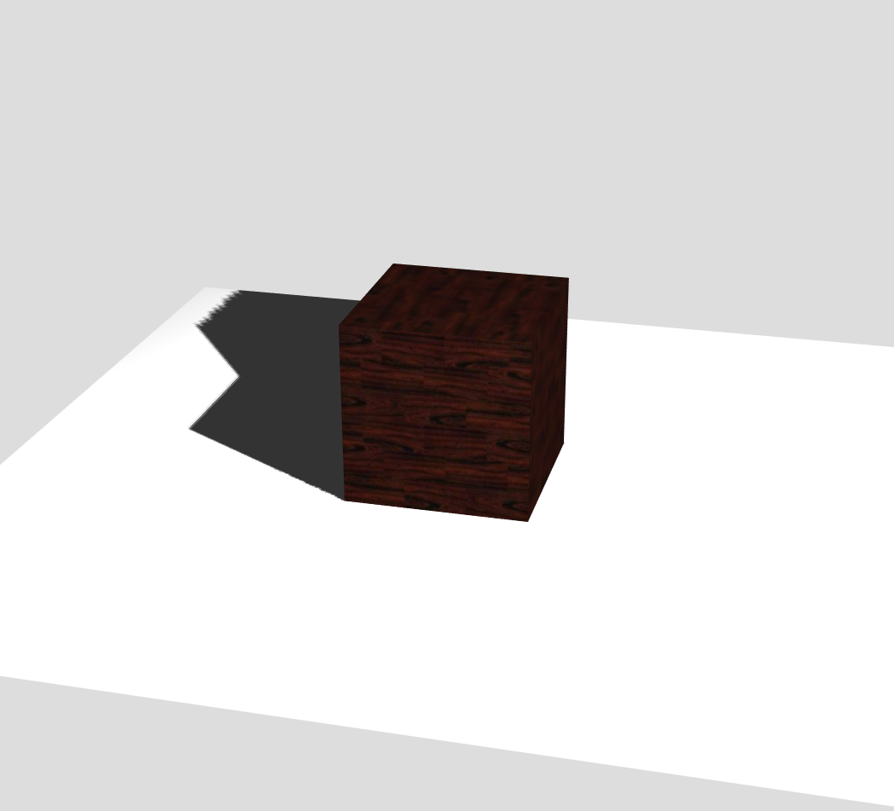
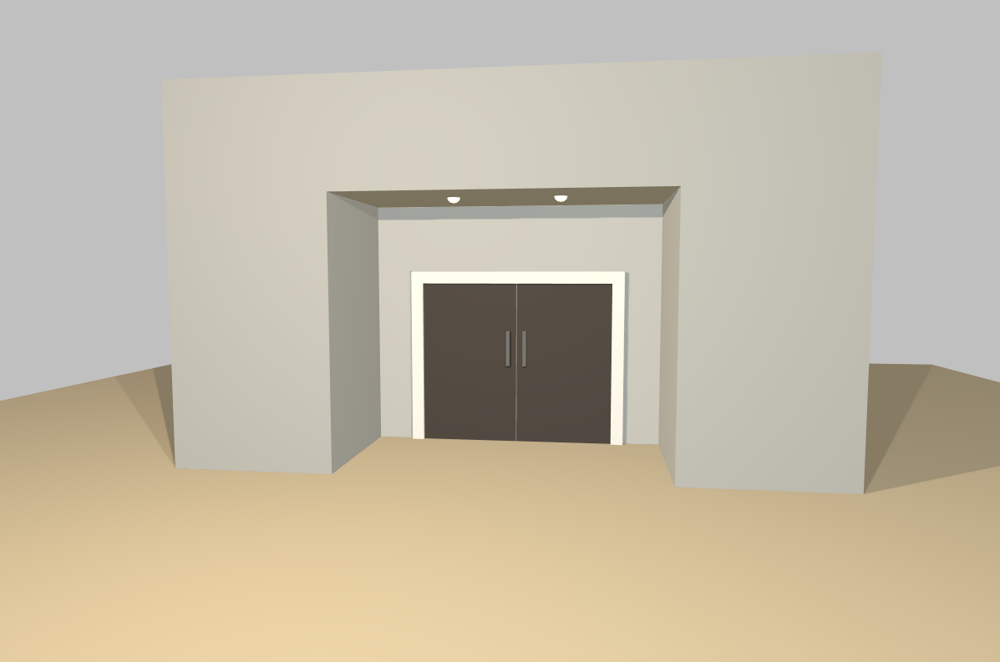

# realistic_object

真实感物体。

使用了[`Threejs`](https://threejs.org/)来绘制，基于WebGL。

## 效果

单个物体示例



包括两个光源，木质纹理贴图的立方体，和一个平面。但是阴影层次没有体现出来，暂时没有找到解决方案。

因此使用`Threejs`提供的在线编辑器进行了在线编辑并预览，得到以下最终效果。



绘制了一个门，门上方有两个半球形光源，门前有两个光源，因此造成了后方不同的阴影，同时使用了环境光，所以不是完全黑暗的阴影。

## 查看

**object** 因为使用了本地图片作为纹理，需要暂时允许文件跨域，关掉chrome，并以`--allow-file-access-from-files`flag重新打开chrome

```shell
start chrome --allow-file-access-from-files
```

再打开`index.html`即可。

**objects** 因为没有使用本地图片作为纹理，所以直接打开`index.html`即可。
